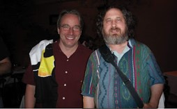
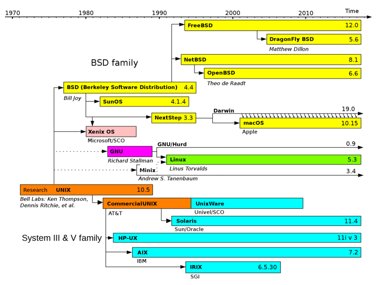
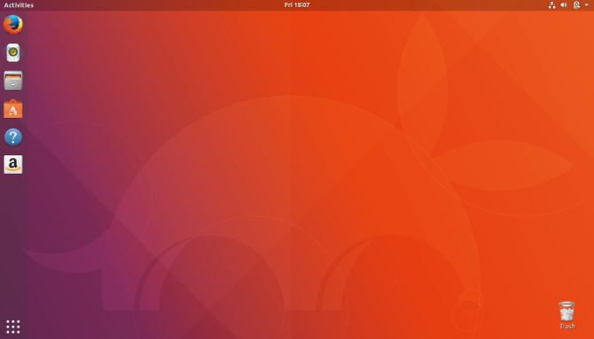

# Chapter 01 - Introduction to Linux

## A Brief History

### UNIX

UNIX was originally an operating system developed at AT&T Bell Labs in the 1970's by **Ken Thompson** (UTF-8 character encoding and Google GO language) and **Dennis Ritchie** (invented C programming language).

AT&T Bell Labs licensed the source code of UNIX.

At 1980 *Unix System V* was being sold as commercial version by AT&T and BSD (Berkeley Software Distribution) was being developed based on the original licensed sources

### HURD

Historically, most software has been issued under a closed-source license, meaning that you get the right to use the machine code, but cannot see the source code. The open source philosophy is that you have a right to obtain the software, and to modify it for your own use.

**Richard Stallman** (creator of GPL) was looking to create a truly free and open source alternative to the proprietary Unix system. He was working on the utilities and programs under the name **GNU**, a recursive acronym meaning "GNU's not Unix!".

Although there was a kernel project underway, it turned out to be difficult going, and without a kernel, the free and open source operating system (HURD) dream could not be realized.

### Linux Kernel

It was in 1991 that a Finnish computer science student called **Linus Torvalds** started creating the **Linux kernel**.

It was **based on the Minix operating system** (by Andrew S. Tanenbaum). **Minix** is an open source operating system developed by Andrew S. Tanenbaum, professor emeritus of computer science at the Vrije Universiteit Amsterdam in the Netherlands, which he created as an example for his book "Operating Systems: Design and Implementation".

Minix is ​​partly based on Unix, but with a microkernel instead of the traditional monolithic kernel. The intention of Minix was that students could understand it in three months of study.

When Linus Torvalds wanted to make an operating system himself in 1991, he was inspired by Minix, but wrote the code of the operating system itself. With additions from others via the internet, this resulted in the Linux kernel, which is a monolithic kernel and not a microkernel.

::: tip Microkernel vs Monolithic kernel
Basically a **monolithic kernel** is a single large process running entirely in a single address space. It is a single static binary file. All kernel services exist and execute in the kernel address space. The kernel can invoke functions directly. Examples of monolithic kernel based OSs: Unix, Linux.

With a microkernel, the kernel is broken down into separate processes, known as servers. Some of the servers run in kernel space and some run in user-space. All servers are kept separate and run in different address spaces. Servers invoke "services" from each other by sending messages via IPC (Interprocess Communication). This separation has the advantage that if one server fails, other servers can still work efficiently. Examples of microkernel based OSs: Mac OS X and Windows NT.
:::

Linus made the project open source and allowed people to freely use and contribute to the Linux kernel.

Currently the official kernel received contributions from over 12000 programmers.

It was Linus Torvald's work - producing a working and viable kernel that he called Linux - that brought the complete operating system to life.

Given that Linus was using several GNU tools (e.g., the GNU Compiler Collection, or GCC), the marriage of the GNU tools and the Linux kernel was a perfect match.

### Timeline

## Linux

Linux was originally developed as a free operating system for personal computers based on the Intel x86 architecture but has since been ported to more computer hardware platforms than any other operating system. This includes desktop PCs, servers, mainframes, supercomputers, smartphones, tablets, TVs, embedded systems, ...

The definition of the word Linux depends on the context in which it is used.

Linux means the kernel of the system, which is the central controller of everything that happens on the computer. People that say their computer "runs Linux" usually refer to the kernel and suite of tools that come with it, called the **distribution**.

### Popular Linux Distributions

A Linux distribution is usually built around a package management system, which puts together the Linux kernel, free and open-source software, and often some proprietary software.

Some popular distributions are listed below.

#### Ubuntu

Ubuntu is probable the most popular Linux distribution at the moment. It's both attractive for a beginning Linux user as well as a hardened Linux guru. While popular as a desktop edition for developers it's also often used as a server OS because of it's LTS (Long Time Support) editions.

Like Debian, Ubuntu uses the DEB package manager, while later versions of Ubuntu also include Snap packages so that installing new software is a simple, straightforward process.

Ubuntu also has a massive user base, which means its has a highly active community on which new and advanced users can fall back for support. There are also plenty of derivatives like **Lubuntu** and **Xubuntu**.

#### Red Hat

Red Hat started out as a simple distribution that introduced the Red Hat Package Manager (RPM). The developer eventually formed a company around it, which tried to commercialize a Linux desktop for business. Over time, Red Hat started to focus more on the server applications such as web and file serving, and released Red Hat Enterprise Linux, which was a paid service on a long release cycle.

#### CentOS

Because everything in Red Hat Enterprise Linux is open source, a project called CentOS came to be, that recompiled all the RHEL packages and gave them away for free. CentOS and others like it (such as Scientific Linux) are largely compatible with RHEL and integrate some newer software, but do not offer the paid support that Red Hat does.

**Scientific Linux** is an example of a specific use distribution based on Red Hat. The project is a Fermilab sponsored distribution designed to enable scientific computing. Among its many applications, Scientific Linux is used with particle accelerators including the Large Hadron Collider at CERN.

**Open SUSE** was originally derived from Slackware, yet incorporates many aspects of Red Hat. While Open SUSE is desktop based and available to the general public, SUSE Linux Enterprise contains proprietary code and is sold as a server product.

**Debian** is more of a community effort (promotes the use of open source software and adherence to standards). Debian came up with its own package management system, based on the .deb file format. Red Hat leaves non Intel and AMD platform support to derivative projects, while Debian supports many of these platforms directly.

**Ubuntu** is the most popular Debian derived distribution.

**Linux Mint** was started as a fork of Ubuntu Linux, while still relying upon the Ubuntu repositories. There are various versions, all free of cost, but some include proprietary codecs, which can not be distributed without license restrictions in certain countries. Linux Mint is quickly supplanting Ubuntu as the world's most popular desktop Linux solution.

[Checkout this interactive Timeline](https://futurist.se/gldt/wp-content/uploads/12.10/gldt1210.svg)

## Some Good Videos

<iframe width="560" height="315" src="https://www.youtube.com/embed/aurDHyL7bTA" frameborder="0" allow="accelerometer; autoplay; encrypted-media; gyroscope; picture-in-picture" allowfullscreen></iframe>

<iframe width="560" height="315" src="https://www.youtube.com/embed/jowCUo_UGts" frameborder="0" allow="accelerometer; autoplay; encrypted-media; gyroscope; picture-in-picture" allowfullscreen></iframe>

<!-- Ideas: Maybe we should give an overview here of all the things this course is going to cover. -->
<!-- Short introduction into each and how they are tight together. -->
