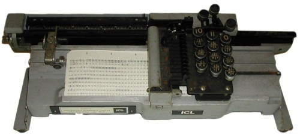
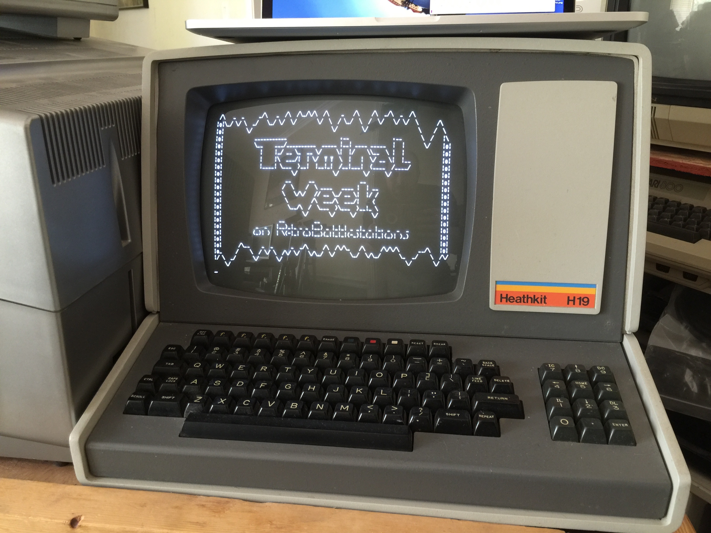

# Chapter 03 - The Command Line

<!-- TODO - Needs a nice intro -->

## The CLI

* A CLI (Command Line Interface) provides
  * more precise control
  * greater speed
  * and the ability to easily automate tasks through scripting
* Although Linux does have many GUI environments, you will be able to control Linux much more effectively by using the CLI.

## The Terminal

In the olden days, when computers were room-sized multi-user computer systems owned by companies and universities, the machines are placed inside secured rooms that were inaccessible by normal users. These normal users could however **interact with the system remotely using a terminal**, which used to be a printer for output, called a TeleTYpewriter (TTY), and a punch card system for input.

Later the terminal evolved to a display and keyboard which could be used to interact with the computer.

These days the terminal is nothing but a software application that emulates the old physical terminals. That's why the actual correct name of this application is **terminal emulator**, but most people will talk about the terminal.

This terminal application, provides an interface that allows interaction with the user. It can read commands from the user and it can output text to the screen. The terminal application is however a very basic program that can provide the CLI but does not actually do anything more. The application that actually executes the commands from the user is called the **shell**.

So in short, the terminal emulator is an application accepts what the user types and passes to a shell. THe output from the shell is then redirected back to the terminal and displayed to the user.

Some free and commonly-used terminal emulators are:

* Putty for Windows
* Terminal and iTerm 2 for Mac OS X
* Terminal, KDE Konsole, XTerm and Terminator for Linux

## Some Good Videos

<iframe width="560" height="315" src="https://www.youtube.com/embed/hMSByvFHOro" frameborder="0" allow="accelerometer; autoplay; encrypted-media; gyroscope; picture-in-picture" allowfullscreen></iframe>
